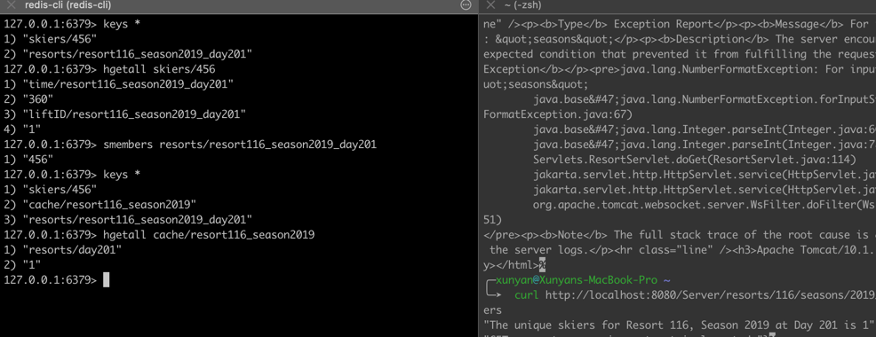

# CS6650 Final Project Report

Group: Xunyan Zhang, Yiwei Zha, Fengjiao Sheng

## Project Structure

1. Client
   * Producer - Assignment 3
   * Retriever - Assignment 4 / ResortClient
2. Server
    * SkierServlet
    * ResortServlet
3. Consumer
    * Configuration
    * Database Design

## Architecture

### Database Design

1. KEY skiers/skierID: hash
   * FIELD time/resort{resortID}_season{seasonID}_day{dayID}: list/str
   * FIELD liftID/resort{resortID}_season{seasonID}_day{dayID}: list/str
2. KEY resorts/resort{resortID}_season{seasonID}_day{dayID}: set (skierID)
3. KEY cache/resort{resortID}_season{seasonID}: hash
   * FIELD skierID{skierID}/vertical: int (total verticals for skierID)
   * FIELD skierID{skierID}/dayID{dayID}: int (vertical at dayID)
   * FIELD resorts/dayID{dayID}: int (unique numbers of skiers)

